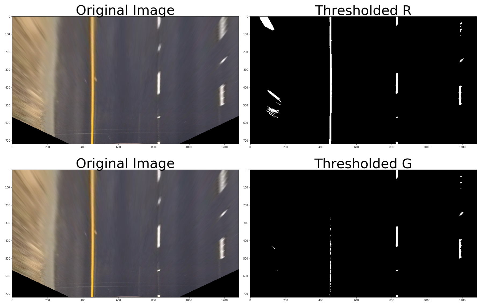

# Advanced Lane Finding Project

**The goals / steps of this project are the following:**

* Compute the camera calibration matrix and distortion coefficients given a set of chessboard images.
* Apply a distortion correction to raw images.
* Use color transforms, gradients, etc., to create a thresholded binary image.
* Apply a perspective transform to rectify binary image ("birds-eye view").
* Detect lane pixels and fit to find the lane boundary.
* Determine the curvature of the lane and vehicle position with respect to center.
* Warp the detected lane boundaries back onto the original image.
* Output visual display of the lane boundaries and numerical estimation of lane curvature and vehicle position.

[//]: # (Image References)

[image1]: ./camera_cal/undistort_output.png "Undistorted"
[image2]: ./test_images/test1.jpg "Road Transformed"
[image3]: ./examples/binary_combo_example.jpg "Binary Example"
[image4]: ./examples/warped_straight_lines.jpg "Warp Example"
[image5]: ./examples/color_fit_lines.jpg "Fit Visual"
[image6]: ./examples/example_output.jpg "Output"
[video1]: ./project_video.mp4 "Video"

## [Rubric](https://review.udacity.com/#!/rubrics/571/view) Points

### Here I will consider the rubric points individually and describe how I addressed each point in my implementation.  

---

### Writeup / README

#### 1. Provide a Writeup / README that includes all the rubric points and how you addressed each one.  You can submit your writeup as markdown or pdf.  

You're reading it!

### Camera Calibration

#### 1. Briefly state how you computed the camera matrix and distortion coefficients. Provide an example of a distortion corrected calibration image.

The code for this step is contained in the first code cell of the IPython notebook located in "./final_advance_lanes.ipynb" .  

I started by preparing "object points", which will be the (x, y, z) coordinates of the chessboard corners in the world. Here I am assuming the chessboard is fixed on the (x, y) plane at z=0, such that the object points are the same for each calibration image.  Thus, `objp` is just a replicated array of coordinates, and `objpoints` will be appended with a copy of it every time I successfully detect all chessboard corners in a test image.  `imgpoints` will be appended with the (x, y) pixel position of each of the corners in the image plane with each successful chessboard detection.  

I then used the output `objpoints` and `imgpoints` to compute the camera calibration and distortion coefficients using the `cv2.calibrateCamera()` function.  I applied this distortion correction to the test image using the `cv2.undistort()` function and obtained this result: 


### Pipeline (single images)

#### 1. Example of a distortion-corrected image.

To apply a distortion correction to raw images I used the calibration matrix (mtx) and dist obtained from performing cv2
calibrateCamera using the objpoints and imgpoints from ChessboardCorners. The result is displayed below:


#### 2. Describe how (and identify where in your code) you used color transforms, gradients or other methods to create a thresholded binary image.  Provide an example of a binary image result.

I used a combination of color and gradient thresholds to generate a binary images. These can be found in the code blocks after calibration in the same python notebook. Here's an example of my output for this step using the straight line images 





 

#### 3. Describe how (and identify where in your code) you performed a perspective transform and provide an example of a transformed image.

The code for my perspective transform includes a function called `warp()`, which appears in the code cell after the camera calibration of the IPython notebook.  The `warp()` function takes as inputs an image (`img`), as well as source (`src`) and destination (`dst`) points.  I chose the hardcode the source and destination points plus some offset. The points came out in the following manner, in clockwise order:

```python
top_left_y = exampleImg.shape[0]//1.54
top_left_x = exampleImg.shape[1]//2 - offset_x

top_right_y = exampleImg.shape[0]//1.54
top_right_x = exampleImg.shape[1]//2 + offset_x

bottom_right_y = exampleImg.shape[0] - offset_y
bottom_right_x = exampleImg.shape[1]//1.16

bottom_left_y = exampleImg.shape[0] - offset_y
bottom_left_x = exampleImg.shape[1]//5.12

src = np.float32([[top_left_x, top_left_y],
                  [top_right_x, top_right_y],
                  [bottom_right_x, bottom_right_y],
                  [bottom_left_x, bottom_left_y]])
dst = np.float32([[200, 0],
                 [1100, 0],
                 [1100, 720],
                 [200, 720]])
```

This resulted in the following source and destination points:

| Source        | Destination   | 
|:-------------:|:-------------:| 
| 620, 441      | 200, 0        | 
| 660, 441      | 1100, 0       |
| 1103, 675     | 1100, 720     |
| 249, 675      | 200, 7200     |


I verified that my perspective transform was working as expected by drawing the `src` and `dst` points onto a test image and its warped counterpart to verify that the lines appear parallel in the warped image.


#### 4. Describe how (and identify where in your code) you identified lane-line pixels and fit their positions with a polynomial?

To identify the lane lines pixels I used the sliding window method that we learned in class,  starting from the bottom of the image and sliding towards the top. Thenn I apply polyfit to get the polynomial for the found line. 


#### 5. Describe how (and identify where in your code) you calculated the radius of curvature of the lane and the position of the vehicle with respect to center.

The code to calculate the radius of curvature is in the block labeled as such and after the sliding window method. The method takes in a binary image, polynomial fit, and L and R lane pixel indices. The next step to find the radius of curvature was to convert from meters to pixels in the x and y directions with the following assumptions:

* lane lines 10ft = 3.04 m
* lane width 12 ft = 3.7 m

Then I proceeded to identify all the nonzeros pixels in the image and then fit a polynomial with the resulting x, y points for to the real world using the pixel/distance conversion. Distance from center is image x midpoint - mean of l_fit and r_fit intercepts 

#### 6. Provide an example image of your result plotted back down onto the road such that the lane area is identified clearly.

I implemented this step in the function `draw_lane()` in the code block after the radius of curvature calculation.  Here is an example of my result on a test image:


---

### Pipeline (video)

#### 1. Provide a link to your final video output.  Your pipeline should perform reasonably well on the entire project video (wobbly lines are ok but no catastrophic failures that would cause the car to drive off the road!).

Here's a [link to my video result](./project_video_output.mp4)

---

### Discussion

#### 1. Briefly discuss any problems / issues you faced in your implementation of this project.  Where will your pipeline likely fail?  What could you do to make it more robust?

After successfully running the pipeline for lane detection I tried putting it to the test by running it on the both challenge videos. The videos showed me some unexpected behavior that was not happening on the project video. Here is a summary of things i notice and some proposed solutions wherever I could come up with one. 

* Challenge videos, are really a challenge. Very good for debugging and optimizing the pipeline
* Fading lines, different color in the pavement and other deformations on the road cause by any road work seem to greatly affect the performance of the pipeline. I noticed this caused the pipeline to mistake a line line for a repaved line that shows two different pavement colors. solution approaches were to play with the color conversions to try to minimmize the light and coloring effects but I didn't come up with anything successful enough.
* Sharp and back to back curves really confused my pipeline. I noticed this can be due to the rectagle mask to enclosed the lane and lines went too far up in the frame causing it not to pick up the curve correctly. I tried assuming must/all frames only have useful information in the bottom of the image where the road is, the sky and tree lines are useles, therefore cropping  the image and running the cropped images through the pipeline to see if it does better under very curvy scenarios
* Sun reflecting on the windshield makes some frames very bright totally losing the pipeline. 
